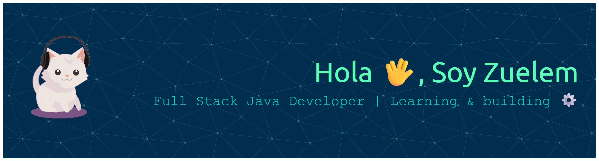

  

🌸 Terapeuta de profesión | 💻 Aprendiendo Desarrollo Full Stack (Java)

## Actualmente
Estudio y disfruto 😊 resolviendo retos de desarrollo en un bootcamp de Generation.

## Herramientas
Estoy comenzando a trabajar con:
- Git  
- GitHub  

## Sobre mí
Mi formación como terapeuta me permite comprender mejor a las personas, y quiero aplicar esa mirada en el desarrollo de software para crear soluciones accesibles y centradas en el usuario.

## Metas
Quiero desarrollar software intuitivo que tenga un impacto real en la vida de las personas 🙌🌈

## Frase
> "El futuro tiene muchos nombres.  
> Para los débiles es lo inalcanzable,  
> para los temerosos es lo desconocido,  
> y para los valientes es la oportunidad."  
> — Víctor Hugo
